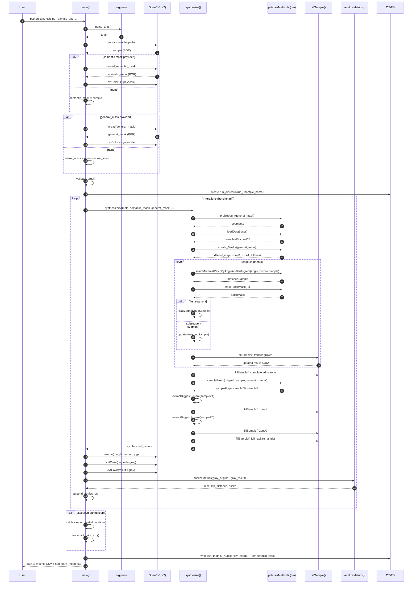

## Sequence Diagram - Full Synthesis Run (Loop + Metrics)

### Notes
- `fillSample()` embodies the pixel growth using weighted normalized SSD and Gaussian kernel.
- Zones: edge (dilated), zone1, zone0, then completion (fullmask).
- Metrics are computed per iteration in grayscale for comparability.
- CSV header lines starting with `#` store run metadata.

### Potential Extensions
- Add early stopping if coverage ratio > threshold.
- Parameterize iteration count via CLI (e.g., `--repeat`).
- Optional disable per-iteration metrics for speed.
